# HCS WorldJumper - System Architecture

```mermaid
graph TD
    subgraph Client Application
        A[index.html Entry Point] --> B[Renderer Controller]
        B -->|WebGPU Supported| C[Three.js WebGPURenderer]
        B -->|Fallback| D[Three.js WebGL2Renderer]
        
        A --> E[UIManager]
        E --> F[Main Menu]
        E --> G[World Selector]
        E --> H[Settings & Audio Sliders]
        E --> I[In-Game HUD & Compass]
        E --> J[F3 Performance Overlay]
        
        A --> K[PlayerController]
        K -->|Kinematic Raycasts| L[Physics Colliders]
        K -->|Surface Queries| M[AudioManager]
        
        A --> N[WeatherSystem]
        N -->|Sun Elevation & Colors| O[Atmospheric Lighting]
        N -->|Particles| P[Rain & Lightning]
        N -->|Harmonic Sway| Q[Vegetation Wind]
    end
    
    subgraph World Storage & Streaming
        R[maps/manifest.json] --> G
        S[output/<map>/world.glb] --> B
        T[output/<map>/regions/] --> B
        U[output/<map>/textures/] --> C
        V[assets/audio/] --> M
    end
```

## Runtime Subsystems Breakdown

1. **UIManager (`src/runtime/ui.js`)**:
   Controls HTML5 DOM overlay layered over the canvas. Uses flexbox and CSS backdrop filters for a premium glassmorphic visual presentation.
2. **PlayerController (`src/runtime/controller.js`)**:
   Manages first-person kinematic movement, downward raycasting against floor slabs, slope detection, wall collision resolution, and player eye height transitions.
3. **WeatherSystem (`src/runtime/weather.js`)**:
   Coordinates atmospheric scattering, fog density, sun light angles, rain particle systems, and vegetation wind animation.
4. **AudioManager (`src/runtime/audio.js`)**:
   Implements an asynchronous Web Audio API audio graph with master gain, weather channel, ambient background loops, and positional footsteps.
